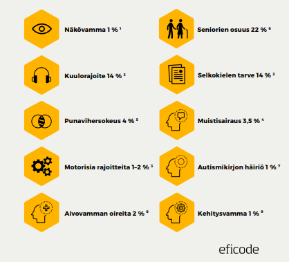

# Saavutettavuus

Saavutettavuus (accessibility) tarkoittaa sitä, että kaikki voivat käyttää verkkopalvelua riippumatta toimintarajoitteista, joita voivat aiheuttaa esimerkiksi erilaiset vammat tai korkea ikä.

Laki digitaalisten palveluiden tarjoamisesta velvoittaa merkittävän osan digitaalisista palveluista huolehtimaan saavutettavuudesta riittävällä tasolla. Tämä koskee tällä hetkellä ennen kaikkea julkisia palveluita, mutta on laajenemassa osin myös yksityisiin.

Arvioidaan, että 30-40 %:lla internetin käyttäjistä on joitakin käyttöön liittyviä rajoitteita. Siksi saavutettavuus koskee muun muassa seuraavia väestöryhmiä:
- ikääntyneet
- sokeat, heikkonäköiset, värisokeat ja ikänäköiset
- kuulovammaiset ja kuurot
- henkilöt, joilla on kognitiivisia rajoitteita, kuten oppimisen ja ymmärtämisen ongelmia, kielellisiä vaikeuksia, autismikirjon häiriöitä tai muistisairauksia
- henkilöitä, joilla on käsien motoriikan rajoitteita
- henkilöitä, jotka käyttävät vanhoja laitteita tai verkkoselaimia tai joilla on huono verkkoyhteys
- kokemattomat käyttäjät
- vain näppäimistön käyttäjät

Eficoden saavutettavuusoppaassa esitetään rajoitteisten henkilöiden määrä seuraavasti:


Erilaisia rajoitteita ja rajoitteellisia käyttäjiä on siis paljon. Lisäksi henkilöillä voi olla väliaikaisia rajoitteita, jolloin hyvin saavutettava palvelu voi auttaa myös heitä.

Aluehallintovirastolla on suomeksi saavutettavuusvaatimuksia listaava sivusto, jolla käydään läpi myös [WCAG 2.1 lain vaatimukset](https://www.saavutettavuusvaatimukset.fi/digipalvelulain-vaatimukset/wcag-2-1/)<base target="_blank">. Laissa todetaan, että kaikki A- ja AA-tason kriteerit tulee täyttää, AAA-tason kriteerit eivät ole pakollisia.

## Kontrastit

Yksi saavutettavuuden kriteereitä on värikontrastit eli tekstin tulee erottua riittävän selkeästi taustasta. Kontrastia voi testata erilaisilla verkkopalveluilla, esimerkiksi [WebAIMin palvelulla](https://webaim.org/resources/contrastchecker/)<base target="_blank">. Se antaa vastaukseksi jonkin astearvon. Hyvä taso AA on lain mukaan 4.5:1, mutta siihen vaikuttaa muun muassa tekstin koko jne. 

## Elementtien koko

Sekä tekstin että elementtien tulee olla riittävän suuria. Niiden pitää olla myös suurennettavissa. Nappien ja muiden interaktiivisten elementtien koon tulee olla suuri, jotta niihin on helppoa osua myös esimerkiksi tärisevin käsin.

## Käytettävyys ruudunlukijalla

Olemme käyneet jo aikaisemmin läpi sitä, että HTML-elementit nimetään semanttisesti oikein, jotta ruudunlukijat osaavat lukea ja käyttää niitä. Esimerkiksi ``<div>`` on käytännössä näkymätön ruudunlukijalle, joten vaikka se on mahdollista muotoilla näyttämään ja toimimaan kuin nappi, se on saavutettavuuden kannalta todella huono. Eli napin kuuluu olla joko ``<button>`` tai ``<input type="button">``. Sama koskee navigointia eli on tärkeää, että siinä on ``<nav>``, jonka sisällä on lista, jotta ruudunlukijat osaavat käyttää navigontia.

Semanttisten elementtien lisäksi on olemassa WAI-ARIA (Web Accessibility Initiative Accessible Rich Internet Applications), jota voi lisätä HTML-elementteihin antamaan lisätietoja kyseisestä elementistä. Ne eivät muuta HTML:n ulkonäköä tai toimivuutta, mutta voivat vaikuttaa ruudunlukijaan. Periaatteessa jos HTML-elementit on valittu semanttisesti oikein, WAI-ARIA-merkinnät ovat tarpeettomia. Semanttiset elementit kehitettiin suunnilleen yhtä aikaa WAI-ARIAn kanssa. Niillä voi kuitenkin joskus selkeyttää jotain elementtiä, kun visuaaliset vihjeet ovat pois käytöstä. 

````html
<a aria-label="Read more about some awesome article title">Read More</a>
````

Esimerkissä oletetaan, että jokin ulkoasussa ilmaisee, että tämä on erityisen kiinnostava artikkeli.

Käykää tutustumassa WAI-ARIAn perusteisiin [täällä](https://web.dev/learn/accessibility/aria-html?continue=https%3A%2F%2Fweb.dev%2Flearn%2Faccessibility%23article-https%3A%2F%2Fweb.dev%2Flearn%2Faccessibility%2Faria-html)<base target="_blank">.

## Kuvat

Kuvilla kuuluu olla aina koodissa kuvausteksti eli *alt*. Ruudunlukija lukee sen käyttäjälle. Siksi kannattaa panostaa *alt*-tekstiin sen mukaisesti, kuinka tärkeä kuva on. Jos se on merkityksetön kuvituskuva, hyvä *alt* on ihan vain *Kuvituskuva*. Tai vaihtoehtoisesti se voi olla *""* eli tyhjä, mikä ei siis ole sama kuin puuttuva. Kuvituskuvan voi myös piilottaa ruudunlukijalta seuraavilla tavoilla WAI-ARIAlla: 

````html
<!-- All of these choices lead to the same result. -->


````
