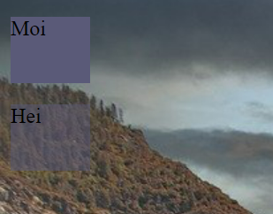

# Värit

Internetselaimet ymmärtävät 140 eri värinimeä, jotka löytyvät [täältä](https://www.w3schools.com/colors/colors_names.asp)<base target="_blank">.

Kyseisistä väreistä ei silti aina löydy joka tilanteeseen sopivaa sävyä. Silloin värille voi määritellä sävyn muilla tavoilla. 

## HEX

Yleisimpänä käytetään HEX-arvoja, jotka kertovat heksadesimaalinumeroilla, kuinka paljon punaista, vihreää ja sinistä värisävyssä on. Arvot ilmoitetaan siis numeroilla 1-9 ja kirjaimilla a-f ja arvon edessä on aina *#*. Jos kaikki HEX-arvot ovat *f*, on väri valkoinen, jos ne ovat kaikki *0*, on väri musta. Allaolevan koodiesimerkin väri on siis valkoinen.

````css
h1 {
    color: #ffffff;
}
````

Eri HEX-värejä voi käydä etsimässä [täällä](https://www.w3schools.com/colors/colors_picker.asp?colorhex=9ACD32)<base target="_blank">.

## RGB

Myös RGB perustuu punaisen, vihreän ja sinisen määrän ilmoittamiseen, mutta kirjoitustapa on pidempi. Se koostuu kolmesta luvusta, jotka ovat välillä 0-250. Jos kaikki ovat *0*, on väri musta, jos kaikki ovat *250*, on väri valkoinen.

````css
h1 {
    color: rgb(250, 250, 250);
}
````

RGB:n lisäetuna on, että samalla voi ilmoittaa myös läpinäkyvyyden lisäämällä lukujen perään desimaalilukuna läpinäkyvyyden, missä 1 on täysin näkyvä ja 0 täysin läpinäkyvä.

Alla esimerkissä on kaksi laatikkoa, joilla on sama RBG-sävy, mutta toisen läpinäkyvyys on vain puolet.

````css
.solid {
    height: 50px;
    width: 60px;
    background-color: rgb(90, 90, 120);
}
.nonsolid {
    height: 50px;
    width: 60px;
    background-color: rgb(90, 90, 120, 0.5);
}
````

Kuva lopputuloksesta.


Mutta huomaathan, että läpinäkyvyys ei ole oikea tapa vaalentaa väriä, sillä joskus se sekoittuu muun taustan kanssa, kuten alla. Sillä on kuitenkin mahdollista saada aikaan kiinnostavia efektejä.



Huom. jokin elementin läpinäkyvyyttä voi säätää myös *opacity* -ominaisuudella.
## HSL

HSL tulee sanoista *hue*, *saturation* ja *lightness* eli sävy, kylläisyys ja valoisuus. Se koostuu kolmesta osasta, joista ensimmäinen on luku 0-360 ja seuraavat kaksi prosenttilukuja. Lisäksi perään voi lisätä RGB:n tavoin läpinäkyvyyden 0-1.

HSL on harvoin käytössä, joten siitä voi lukea lisää [täältä](https://www.w3schools.com/css/css_colors_hsl.asp)<base target="_blank">

## Demotehtävä

1. Avaa [w3schoolsin color picker](https://www.w3schools.com/colors/colors_picker.asp?colorhex)<base target="_blank">.
2. Valitse kolme eri väriä, joista valitset lisäksi yhden vaaleamman ja yhden tummemman värisävyn. Kirjoita ne itsellesi esimerkiksi Word-dokumenttiin ylös sekä HEX-värinä että RGB-värinä. Tallenna värisävyt paikkaan, mistä löydät ne myöhempää käyttöä varten.