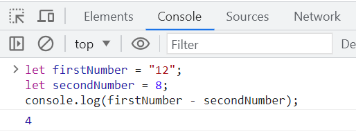
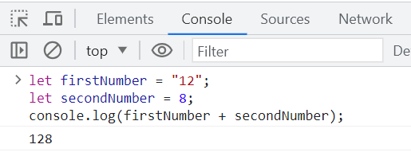
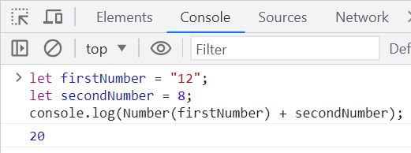

# Muuttujien muuntaminen

## Matemaattiset operaatiot

JavaScriptillä voidaan tehdä monenlaisia matemaattisia laskutoimituksia.

Tässä ovat matemaattiset operaattorit:

| Operaattori    | Esimerkkejä    | 
| --------------------- |:-------------:| 
| + (yhteenlasku) | ```4 + 5 ``` | 
| - (vähennyslasku) | ```4.5 - 3.1 ``` |
| * (kertolasku)| ```90 * 0.23``` |
| / (jakolasku) | ```3 / 20``` |
| ** (potenssiin korotus) | ``` 2 ** 10``` |
| % (modulo, jakojäännös) | ``` 10 % 6``` |

Laskujärjestys ilmoitetaan sulkujen avulla:
```js
(20 + 3)/(14 - 2)
```

Nämä toimivat, jos kaikki muuttujat ovat tyyppiä *number*. 

## Demotehtävä 1

Tehdään muutama yksinkertainen lasku JavaScriptillä.

1. Luo ensin kaksi muuttujaa. *let firstNumber = 18;* ja *let secondNumber = 7;* Tulosta niiden summa konsoliin: *console.log(firstNumber + secondNumber);* . 
2. Luo uusi muuttuja nimeltään *sum*. Anna sille arvoksi *firstNumber + secondNumber*. Tulosta *sum* konsoliin.
3. Vähennä *firstNumber*ista *secondNumber* ja tulosta se konsoliin.
4. Jaa *sum* *secondNumber*illa ja tulosta se konsoliin.

___

## Tyyppimuunnokset

Koska JavaScript on dynaamisesti tyypitetty ohjelmointikieli, muuttujan tyyppiä on mahdollista vaihtaa ja joissakin tilanteissa JavaScript tekee sen automaattisesti. 

Jos käyttäjä haluaa vähentää numeron merkkijonosta, se onnistuu, mikäli merkkijono sisältää ainoastaan numeroita. 



Kuitenkin jos merkkijonoon, jossa on vain numeroita, yrittää lisätä numeron, tapahtuukin jotain muuta. 



Tässä tapauksessa JavaScript kohtelee molempia ikään kuin ne olisivat merkkijonoja. 

Ohjelmoija voi halutessaan muuntaa useita muuttujia eri tyyppisiksi välttääkseen tällaiset ongelmat.

````JS
let firstNumber = "12";
let secondNumber = 8;
firstNumber = Number(firstNumber);
````

Aiemman lisäämisongelman voisi ratkaista myös tällä tavalla: 



Numeron voi muuntaa myös merkkijonoksi:

````JS
let secondNumber = 8;
secondNumber = String(secondNumber);
````

___

## Merkkijonot

Pidempiä merkkijonoja voidaan muodostaan yhdistelemällä lyhyempiä. Lausekkeessa voi olla mukana muuttujia sekä lukuja. Usein merkkijonoja tulostetaan konsolille:

```js
console.log("Tämän ohjelman nimi on: " + name + ".");
```

Selaimessa toimii myös alert-ikkuna (ei toimi node.js:n kanssa):

```js
alert('Soita numeroon ' + number);
```

Merkkijonon pituuden saat selville *length*:in avulla:

```js
info.length
```

## Demotehtävä 2

1. Luo muuttuja *name*, jos sitä ei vielä ole. Tulosta konsoliin teksti, jossa on alkuosana *Minun nimeni on*, sitten muuttuja *name* ja lopussa piste. Katso tarkkaan, onko lainausmerkkien sisällä oikea määrä välilyöntejä, jotta teksti ei tule putkeen.
2. Testaa alert-laatikkoa. Luo ensin muuttuja nieltään *errorMessage* ja kirjoita siihen merkkijono, jossa lukee jotain vastaavaa kuin *Something went wrong. Contact ** ja luo lisäksi uusi muuttuja nimeltään *phoneNUmber* ja anna sille jokin arvo, joka näyttää puhelinumerolta. Sitten tulosta *errorMessage* + *phoneNumber* alert-laatikon kautta.
3. Tarkista muuttuja errorMessage pituus. Tulosta se konsoliin.

___

## Totuusarvojen vertailu


Ehtolauseissa käytetään usein vertailuoperaattoreita. Vertailuoperaatio palauttaa totuusarvon (true/false):

| Vertailuoperaattori    | Esimerkkejä      | 
| ---------------------- |:-------------:| 
| < (pienempi kuin)   | ``` 2 < 2``` | 
| > (suurempi kuin)     | ``` -1 > 0 ```     |  
| <= (pienempi tai yhtäsuuri kuin)   | ``` 20 <= 2``` | 
| >= (suurempi tai yhtäsuuri kuin)     | ``` -1 >= -1 ```     | 
| == (yhtäsuuri)| ```90 == "90"``` |
| === (yhtäsuuri ja samaa tyyppiä) | ```90 === 900/10``` |
| != (erisuuri) | ``` 2 != 10``` |


## Demotehtävä 3

1. Testaa vertailuoperaatioita. Luo muuttujat *date* ja *date2* ja anna niille jokin eri numeroarvo. Kokeile ensin, ovatko ne samankokoiset konsolissa eli *console.log(date == date2);*. Sitten kokeile vertailla niitä vertailumerkeillä.
2. Luo muuttuja *date3*, joka on merkkijono, jonka sisällä on numero ja joka on sama kuin *date2*. Testaa, ovatko ne samoja, kun käytät tuplayhtäläisyysmerkkejä. Sitten testaa, ovatko ne samoja, kun käytät kolmoisyhtäläisyysmerkkejä. 

---

### Ehtolause

JavaScriptissä on kaksi tapaa tehdä ehtolause. Jos ehto on lyhyt sen voi kirjoittaa näin:

```js
let a = 10;
let b = 9;
a > b ? "kissa" : "koira";
```

Tässä alustettiin ensin muuttujat a ja b. Jos vertailu a > b saa arvon *true*, palautuu "kissa" muuten "koira.

Jos tosihaarassa pitää suorittaa enemmän koodia, on parempi käytää if-else-rakennetta (aaltosulkujen sisään voi laittaa useita rivejä koodia ns. koodilohko):
```js
if(a > b){
  "kissa"
  } else {
    "koira"
    }
```

## Demoharjoitus 4

1. Tee ehtolauseke käyttäen aiempia *date*-muuttujia. Jos *date* on suurempi kuin *date2*, tulosta konsoliin *Bigger*. Jos se on pienempi. tulosta konsoliin *Smaller*.